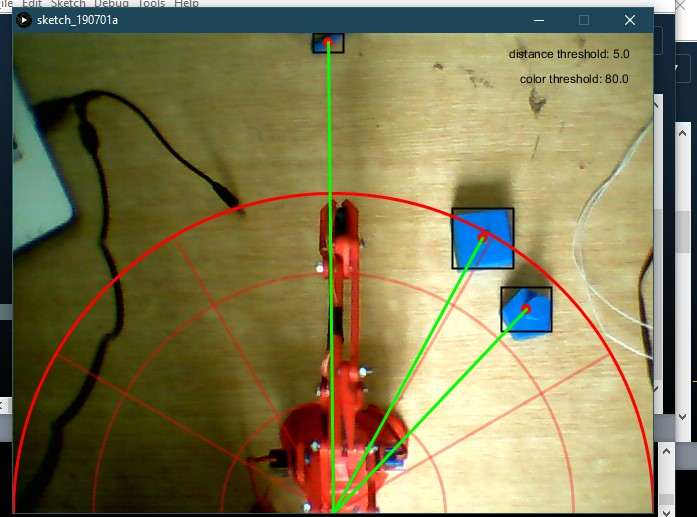

# Robotic-Arm-Processing
Robotic arm with different approches 

**Things you gonna need :**
- Robotic arm with 3 axis and a gripe 
- Arduino 
- Processing IDE

### Calcuations and mappings :

1. All the drawing is using processing java language 
2. Translating angels ( alpha1 , alpha2 and alpha3 ) to Polar (XYZ) cordinate is done by inverse kinematics 
3. mapping distances from cameras perspective into real sizes ( cm )
4. The interface between the scetch and the hardwar ( servo motors) is done by the Firmata library 
5. The detection is done pixle by pixle 

### Programmes working : 

1. The first methode using Color detection  ,the programe will detect the object colors and thier container colors based on the selected RGB set when pressing the key (space) the programe will store the cordinates in an array and than move each object to its container 
 
2. The seconnd methode usig the mouse and keyboard , click certain key to start storing the objects cordinates on the first array and clicking another key to start storing their final destination by order finally clicking the (space) key to start the procuder of taking each object to its destination 

3. the third methode is fully manual using the mouse , (x y z)  depend on the cursor cordinate and the wheel counter 
